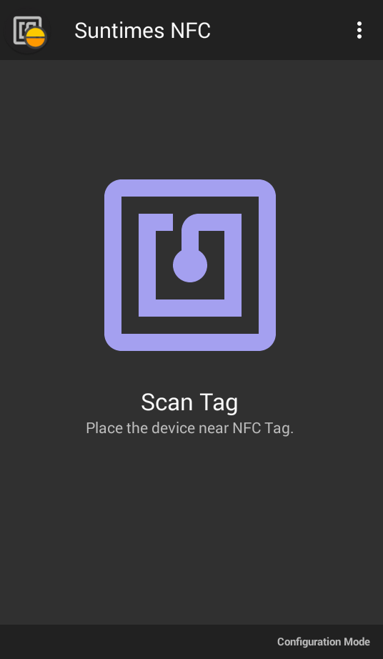

# Suntimes NFC
An NFC add-on for Suntimes Alarms. It depends on [Suntimes v0.15.0](https://f-droid.org/en/packages/com.forrestguice.suntimeswidget/) or later.

[](https://github.com/forrestguice/SuntimesNFC/releases)
[](https://github.com/forrestguice/SuntimesNFC/actions?query=branch%3Amain)

* [Donations](#donations)
* [Bug Reports](#bug-reports)
* [Privacy and Permissions](#privacy-and-permissions)
* [Legal Stuff](#legal-stuff)

Features:
* dismiss alarms using an NFC tag.



## Donations ##
Do you find value in this software? Please pay as you feel.

[](https://www.paypal.com/cgi-bin/webscr?cmd=_s-xclick&hosted_button_id=NZJ5FJBCKY6K2)

<noscript><a href="https://liberapay.com/forrestguice/donate"></a></noscript>


## Bug Reports ##
Use the issue tracker to submit a bug report or a feature request.

When reporting a bug please be detailed as possible. What did you expect the app to do, what did you actually observe? Include the app version numbers in your report. Other useful information includes the Android OS version (and sometimes your specific device model).

## Privacy and Permissions ##
Suntimes NFC does not collect, store, or transmit personal user data. It contains no advertising, no analytics, no trackers, and no unnecessary permissions.

`android.permission.NFC` is required to access NFC hardware.

`android.permission.VIBRATE` is used to provide feedback after scanning a tag.

__Suntimes NFC is an add-on for Suntimes.__ It uses the `suntimes.permission.READ_CALCULATOR` permission in order to access data provided by this app. https://github.com/forrestguice/SuntimesWidget/wiki/Privacy


## Legal Stuff
Copyright (C) 2022-2025 **Forrest Guice**
```
Suntimes NFC is free software: you can redistribute it and/or modify
it under the terms of the GNU General Public License as published by
the Free Software Foundation, either version 3 of the License, or
(at your option) any later version.

Suntimes NFC is distributed in the hope that it will be useful,
but WITHOUT ANY WARRANTY; without even the implied warranty of
MERCHANTABILITY or FITNESS FOR A PARTICULAR PURPOSE.  See the
GNU General Public License for more details.

You should have received a copy of the GNU General Public License
along with Suntimes NFC.  If not, see <http://www.gnu.org/licenses/>.
```

Icons from:
* "Google Material Icons" [Apache License 2.0] (https://material.io/icons/)
